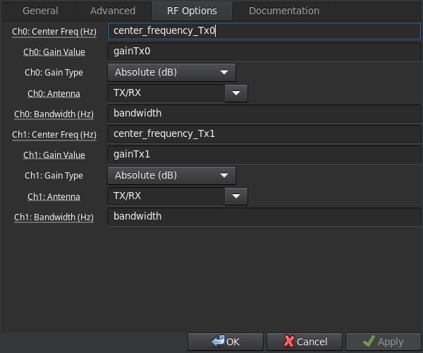

# How to use

## Record

Generate the python file
```
grcc record.grc
```

Start a record for 10min
```
timeout 600s ./record.py
```

## Replay

Generate the python file
```
grcc replay.grc
```

Start a replay
```
./replay.py
```

# Record

The two USRP RX inputs are used to record a Wide or Multi-band signal.

```
                           .-> [USRP RX#1]
[Wide/Multi band signal] --|
                           '-> [USRP RX#2]
```

The `record.grc` script generates one file per input channel.
Please take care of the size of the output files.

Consider to use a storage device with engough bandwidth.
A slow device may produce UHD overflow/underrun or GNURadio crashes/freezes.

 - Prefer PCIe NVME SSD
 - Network storage or external USB storage devices are not recommended

A proposed configuration is:
 | Sampling Rate (MS/s) | Data type | Number of channels | Total recording file rate (MB/s) *[(GB/min)]* |
 |---|---|---|---|
 | 16 | `Complex_Float_32` | 2 | 256 *[15.36]* |

## Hardware

[UBX Getting Started Guides](https://kb.ettus.com/index.php?title=UBX_Getting_Started_Guides)

 - Maximum input power : -15 dBm
 - Use 30 dB attenuation if the USRP is operating in loopback

## GNURadio

### UHD USRP Source


Number of channels: 2


For each channel:
 - sampling rate (proposed: 16 Ms/s)
  - The sampling rate should respect the Nyquist criteria with the signals to record
  - The sampling rate must be set according to the network bandwidth on the `[PC] <--> [USRP]` link
 - center frequency [Hz]
  - consider a frequency shift of few MHz to avoid interferences due to the LO leakage
  - the frequency shift should be compatible with the sampling rate
 - gain value [dB]
 - bandwidth [MHz]

To set up the parameters'values, several blocks'values (the ones on the image above) have to be modified.:


# Replay

The two USRP RX outputs are used to replay a Wide or Multi-band signal.

```
 [USRP TX#1] -.
              |->[Wide/Multi band signal]
 [USRP TX#2] -'
```

The `replay.grc` script read two files (one per output channel) to generate a Wide/Multi band signal.

## GNURadio

### UHD USRP Sink


Number of channels: 2



For each channel:
 - sampling rate (same as record)
 - center frequency (same as record)
 - gain value [dB]
 - bandwidth (same as record)

To set up the parameters'values, several blocks'values (the ones on the image above) have to be modified.:


